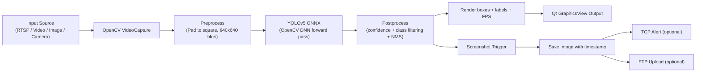

# Object-Detection-and-Alert-Generation

Real-time object detection desktop application built with **Qt + OpenCV DNN (YOLOv5 ONNX)**, including screenshot capture and alert dispatch over TCP/FTP.

## High-Level Architecture


## What This Project Achieves

This project delivers a **real-time object detection system** that integrates computer vision with networked alerting:

- **Detects multiple COCO classes** (80 object types) from live RTSP streams, video files, image sequences, or camera input using state-of-the-art YOLOv5 model.
- **Draws annotated bounding boxes and labels** in real time with class confidence scores overlaid on every detected frame.
- **Supports class-specific filtering** to focus on critical objects like Person, Truck, Car, Motorbike, and Boat—reducing false positives in surveillance applications.
- **Calculates and displays runtime FPS** to monitor system performance and detection latency.
- **Captures evidence screenshots** automatically when detections occur, preserving frames for investigation or auditing.
- **Sends alert payloads to TCP endpoint** for integration with monitoring systems, SIEM platforms, or custom alert handlers.
- **Uploads captured evidence to FTP** for centralized storage and compliance archiving.
- **Provides a professional Qt GUI** with dynamic input selectors, filter toggles, and alert configuration controls—all with a frameless, modern aesthetic.

## Core Features

**Input Modes**  
- **RTSP Stream**: Connect to IP cameras or network video sources using RTSP URLs for continuous monitoring.
- **Video File**: Process pre-recorded video files for offline analysis and batch detection.
- **Image File**: Run inference on static images for testing and validation.
- **Live Camera**: Direct integration with system webcam or USB camera devices.

**Inference Configuration**  
- **CPU or GPU Backend**: Automatic fallback to CPU if CUDA is unavailable; GPU mode provides 3-5x speed improvement on compatible hardware.
- **Model**: YOLOv5 Small (yolov5s) in ONNX format—lightweight yet accurate, reaching 640x640 inference at 30+ FPS on GPU.
- **Classes**: Full COCO dataset support (80 object classes) with persistent `coco.names` reference file.

**Alert Channels**  
- **TCP Messaging**: Send structured alert packets to `127.0.0.1:80` for local system integration—includes detection class and timestamp.
- **FTP Upload**: Batch upload evidence images to configured FTP server for centralized archival and compliance.

**Operator Controls**  
- Dynamic source input field (URL or file path selection).
- Backend selector (CPU/GPU radio buttons).
- Per-class toggle filters (Person, Truck, Car, Motorbike, Boat).
- Screenshot capture enable/disable with output directory picker.
- Independent TCP and FTP alert toggles.
- Start/Stop stream control buttons with clear visual feedback.

## Deep Dive: Detection and Alert Pipeline

### Application Startup Flow

The application initializes in a controlled sequence to ensure all resources are loaded before user interaction:

1. **Qt Application Initialization**: Main window and event loop are created.
2. **Splash Screen Display**: A branded splash screen is shown during initialization (optional 2-3 second delay).
3. **Network Preparation**: TCP socket and FTP manager are initialized but not yet connected—standing by for user interaction.
4. **Main Window Display**: GUI is rendered after resources are loaded, user can now interact with input/alert selectors.
5. **Automatic Connection Attempt**: Optional TCP connection is established during startup if configured (can be toggled).

### Real-Time Inference Pipeline

When a detection stream is started, frames flow through a multi-stage processing pipeline:

**Stage 1: Frame Acquisition**
- VideoCapture or camera device returns raw frame at native resolution (e.g., 1920×1080, 640×480).
- Frame is color-converted from BGR to RGB if needed for model compatibility.

**Stage 2: Preprocessing**
- Frame is resized to square aspect ratio (letterboxed with gray padding) to match YOLOv5's expected 640×640 input.
- Pixel values are normalized to [0, 1] range and converted to a 4D blob (batch_size=1, channels=3, height=640, width=640).
- Blob is sent to OpenCV DNN module for model forward pass.

**Stage 3: Model Inference**
- YOLOv5 ONNX model executes on selected backend (CPU defaults to Intel MKL if available; GPU uses CUDA).
- Model outputs detection tensors with shape [1, 25200, 85]:
  - 25200 = all potential anchor boxes across 3 scales
  - 85 = [x, y, w, h, confidence, 80_class_scores]

**Stage 4: Postprocessing & Filtering**
- Detections are extracted and filtered by:
  - Object confidence (e.g., > 0.45)
  - Per-class confidence (e.g., > 0.50)
  - User-selected class filters (if Person filter is OFF, person detections are discarded)
- Non-Maximum Suppression (NMS) with IoU threshold 0.45 removes overlapping boxes from the same object.
- Remaining detections are sorted by confidence score.

**Stage 5: Rendering & Display**
- Bounding boxes are drawn with colors mapped to class labels (e.g., red for Person, blue for Car).
- Detection labels include class name and confidence score (e.g., "Person 0.92").
- Current FPS and timestamp are rendered at the top-left corner.
- Frame is displayed in Qt's QGraphicsView widget with smooth scaling and panning support.

### Alert Generation & Dispatch

When screenshot capture is enabled and detections occur:

**Alert Trigger**
- Any detection that passes filters triggers an alert cycle (configurable to trigger per-class or per-frame).
- Timestamp, class name, and confidence are recorded.

**Screenshot Capture**
- Current frame with bounding boxes is saved to user-selected directory.
- Filename includes timestamp: `detection_2024_02_12_143025.jpg`.
- Metadata (detected classes, counts, confidences) can be burned as text onto the image.

**TCP Alert (if enabled)**
- Alert packet is formatted as JSON or plain text.
- Packet contains:
  - Detection class name(s)
  - Confidence score(s)
  - Frame timestamp
  - Screenshot file path (if available)
- Packet is sent to TCP server at `127.0.0.1:80`:
  ```
  {
    "alert": "Object Detected",
    "class": "Person",
    "confidence": 0.87,
    "timestamp": "2024-02-12 14:30:25",
    "image": "/alerts/detection_2024_02_12_143025.jpg"
  }
  ```
- Remote receiver can log, forward to SIEM, trigger alarm, etc.

**FTP Upload (if enabled)**
- Screenshot file queued for asynchronous FTP upload.
- FTP upload uses QNetworkAccessManager (Qt's network abstraction).
- Configured FTP endpoint and credentials are used; current implementation hardcodes `admin/admin` on port 21.
- Upload status is tracked; failed transfers can be retried or logged.

**Performance Monitoring**
- Inference latency, preprocessing time, and upload throughput are tracked internally.
- FPS counter on display updates in real time, reflecting actual system throughput.
- If GPU is available and CUDA is enabled, inference speed typically improves 3-5x over CPU.

## Repository Structure

```text
Object-Detection-and-Alert-Generation/
├── README.md
├── Sample Files/
│   ├── sample.jpg
│   ├── sample.mp4
│   └── pexels-jimmy-teoh-1634279.jpg
└── Code/
    ├── main.cpp
    ├── mainwindow.h
    ├── mainwindow.cpp
    ├── mainwindow.ui
    ├── User_Interface.pro
    ├── Source.qrc
    ├── Algorithm/
    │   ├── coco.names
    │   └── yolov5s.onnx
    ├── Icons/
    ├── Background/
    └── debug/               # build artifacts currently checked in
```

## Tech Stack

- **Language**: C++
- **GUI**: Qt 5 Widgets
- **CV/Inference**: OpenCV 4.5.4 (`dnn`, `videoio`, `imgproc`, etc.)
- **Model format**: ONNX
- **Networking**: `QNetworkAccessManager`, `QTcpSocket`

## Build Prerequisites

This project is currently configured primarily for **Windows + Qt Creator + MinGW**.

- Qt 5.15.x (Widgets)
- MinGW toolchain compatible with your Qt kit
- OpenCV 4.5.4 binaries/libraries
- YOLOv5 ONNX model and COCO labels in `Code/Algorithm/`

The `.pro` file links OpenCV libs with Windows-style paths and names.

## Build and Run

### Option A: Qt Creator (recommended)

1. Open `Code/User_Interface.pro` in Qt Creator.
2. Select a Desktop Qt kit (original project used Qt 5.15.2 MinGW 32-bit).
3. Ensure OpenCV include/lib paths are valid for your machine.
4. Build and run target `opencvtest`.

### Option B: qmake CLI

```bash
cd Code
qmake User_Interface.pro
mingw32-make
```

Run generated executable from the build output directory.

## How to Use: Step-by-Step Workflow

### Basic Workflow: RTSP Stream with Alerts

1. **Launch Application**  
   Execute the compiled binary; splash screen appears, main window loads.

2. **Select Source**
   - **RTSP**: Enter camera URL in the input field (e.g., `rtsp://192.168.1.100:554/stream`).
   - **Video/Image**: Click "Choose File" button and browse to video or image file.
   - **Camera**: Select "Camera" mode to use default system camera.

3. **Configure Backend**
   - Select **CPU** for compatibility (slower but always available).
   - Select **GPU** if CUDA is installed and OpenCV was built with CUDA support (faster inference).

4. **Set Class Filters** (Optional)
   - Check boxes for object classes to detect: Person, Truck, Car, Motorbike, Boat.
   - Unchecked classes are ignored during detection.
   - Leave all checked for full 80-class COCO detection.

5. **Enable Screenshot Capture** (Optional)
   - Check "Enable Screenshot" to save evidence images.
   - Click "Browse" to select output directory for captured frames.
   - Screenshots are saved with timestamp filenames.

6. **Enable TCP Alerts** (Optional)
   - Check "TCP Alert" to send detection notifications to `127.0.0.1:80`.
   - Start a TCP server on your local machine on port 80 to receive alerts.
   - Each detection triggers an alert message with class name and confidence.

7. **Enable FTP Upload** (Optional)
   - Check "FTP Upload" to send screenshots to remote FTP server.
   - Enter FTP server URL in the provided field (e.g., `ftp://192.168.1.50/alerts/`).
   - Credentials are currently hardcoded but can be UI-parameterized in future versions.

8. **Start Detection**
   - Click the **"Start"** button to begin stream processing.
   - Bounding boxes and labels appear on detected objects in real time.
   - FPS counter updates continuously in the top-left corner.

9. **Monitor Output**
   - Watch detection results in the QGraphicsView display panel.
   - Observe screenshots being saved to the chosen directory.
   - Check TCP/FTP logs or receiver for alert confirmation.

10. **Stop Stream**
    - Click the **"Stop"** button to halt processing.
    - Stream resources are released; camera/file captures are closed.
    - Any pending FTP uploads continue in the background.

### Troubleshooting Common Scenarios

**"No detections appearing"**
- Check that class filters are not all disabled.
- Verify input stream is valid (test RTSP URL with VLC first).
- Ensure YOLOv5 ONNX model is present in `Code/Algorithm/yolov5s.onnx`.
- Lower confidence thresholds in code if objects should be detected.

**"Low FPS or freezing"**
- Switch to GPU backend if available.
- Increase object confidence threshold to reduce processing of low-confidence detections.
- Reduce input resolution (resize frame before inference).
- Close other GPU-intensive applications.

**"TCP alerts not received"**
- Verify TCP server is listening on `127.0.0.1:80`.
- Check OS firewall is not blocking localhost connections.
- Enable debug logging to verify alert formatting.

**"FTP upload failing"**
- Verify FTP server is reachable and credentials are correct.
- Check firewall rules for outbound FTP (ports 20, 21).
- Ensure FTP server has sufficient storage and user permissions.

## Alerting Setup Notes

### TCP Alerting Details

**How It Works**
- Application opens a `QTcpSocket` connection to localhost TCP port 80 during startup (or on-demand).
- Each detection event (if screenshot mode is enabled) triggers a message send.
- Message is JSON-formatted and includes detection metadata.

**Configuration**
- Destination: `127.0.0.1:80` (hardcoded; can be parameterized in future versions).
- Port: 80 (standard HTTP; can use any privileged port on your system).

**Example TCP Payload**
```json
{
  "event_type": "object_detected",
  "timestamp": "2024-02-12T14:30:25Z",
  "class_name": "Person",
  "confidence": 0.92,
  "bounding_box": {"x": 150, "y": 200, "width": 80, "height": 140},
  "screenshot_path": "/alerts/detection_2024_02_12_143025.jpg"
}
```

**Receiver Requirements**
- Must be a TCP server listening on `127.0.0.1:80`.
- Should parse JSON and extract detection metadata.
- Can trigger downstream workflows (log to file, send email, page on-call team, etc.).

**Testing Locally**
- Use `nc -l 127.0.0.1 80` (requires sudo) to listen on port 80.
- Alternatively, use `nc -l -p 8080` and modify code to connect to port 8080 for testing without root.

### FTP Uploading Details

**How It Works**
- Application uses Qt's `QNetworkAccessManager` to handle FTP transfers asynchronously.
- Screenshot file is queued for upload after being saved locally.
- Upload runs in the background without blocking the detection pipeline.

**Configuration**
- FTP server URL is user-provided in UI (e.g., `ftp://192.168.1.50/screenshots/`).
- Credentials currently hardcoded as `admin/admin` (see **Known Limitations**).
- Port: 21 (default FTP; configurable in code).

**Example FTP Upload**
```
Local file: /home/user/alerts/detection_2024_02_12_143025.jpg
FTP remote: ftp://192.168.1.50/screenshots/detection_2024_02_12_143025.jpg
User: admin
Pass: admin
```

**Reliability**
- Failed uploads are logged; retry logic can be added.
- No guarantee of upload completion (fire-and-forget pattern currently).
- Large screenshots may timeout on slow connections (configurable in `QNetworkAccessManager` timeout).

**Security Notes**
- FTP credentials are transmitted in plain text over the network—use SFTP or secure FTP for production.
- Hardcoded credentials are a security risk; move to config file or environment variables.
- Consider implementing certificate pinning if using secure FTP variants.

## Known Limitations (Current State)

**Path Configuration**
- Model and class file paths are hardcoded to absolute Windows paths (e.g., `C:\\path\\to\\yolov5s.onnx`).
- Moving the project to a Mac or Linux system requires manual path updates in source code.
- Solution: Implement app-relative path resolution (e.g., `./Algorithm/yolov5s.onnx`).

**Security**
- FTP credentials (`admin/admin`) are hardcoded in source and transmitted in plain text.
- No authentication for TCP alert receivers (open port 80 is exposed).
- Solution: Move credentials to encrypted config file or environment variables; implement token-based TCP auth.

**Feature Completeness**
- UI source mode selectors broader than implementation; not all modes fully tested.
- RTSP, Video, Image, and Camera modes may have edge cases or missing error handling.
- Solution: Complete each mode with comprehensive error messages and validation.

**Code Quality**
- Build artifacts (`Code/debug/`) and Qt Creator user files (`.pro.user`) checked into version control.
- No `.gitignore` file; binary files bloat repository size.
- Solution: Add proper `.gitignore` and clean up repository.

**Runtime Logic**
- Screenshot capture and inference use separate frame paths (potential for mismatched evidence).
- No persistent state management (config not saved between sessions).
- Alert deduplication logic missing (could generate many alerts for same object).
- Solution: Consolidate frame handling; add session state serialization; implement alert throttling.

**Testing**
- No unit tests or regression test suite.
- Manual testing is the only validation method.
- Solution: Add Qt Test framework suite and CI/CD pipeline.

## Suggested Improvements & Roadmap

### Short Term (High Impact, Low Effort)

**1. App-Relative Path Resolution**
- Change hardcoded paths to relative or config-based.
- Use `QCoreApplication::applicationDirPath()` to anchor paths.
- Benefit: Cross-platform portability without code changes.

**2. Configuration File (INI or JSON)**
- Move model path, FTP URL, TCP endpoint, and thresholds to a config file.
- Load config on startup; allow UI to edit and persist settings.
- Benefit: Users can customize without recompiling; settings survive app updates.

**3. Session State Persistence**
- Save user's last-selected source, filters, and alert settings.
- Auto-restore on next launch.
- Benefit: Faster workflow; reduced repetitive configuration.

**4. Error Dialog System**
- Replace silent failures with user-facing error messages.
- Show reasons for connection/upload failures with retry options.
- Benefit: Improved debugging; better user experience.

**5. Clean Repository**
- Add `.gitignore` to exclude build artifacts, object files, and Qt Creator user files.
- Rebase history to remove large binaries (use `git filter-repo` if needed).
- Benefit: Smaller repository size; cleaner version control history.

### Medium Term (Significant Feature Additions)

**1. Multi-Stream Support**
- Process multiple RTSP streams or video files simultaneously.
- Display all streams in a grid layout (4-stream, 9-stream layouts).
- Single alert coordinator across all streams.
- Benefit: Scalable surveillance; monitor entire facility in one app.

**2. Persistent Logging**
- Log all detections to SQLite database or CSV.
- Include timestamp, class, confidence, screenshot path.
- Query/export logs for audit trails and analytics.
- Benefit: Compliance-ready audit log; historical analysis.

**3. Configurable Alert Throttling**
- Add a "debounce time" setting to prevent alert spam.
- Skip alerts for the same class within N seconds.
- Benefit: Reduces false alert fatigue; improves actionability.

**4. Model Selection UI**
- Allow users to upload and switch between different ONNX models.
- Support YOLOv5, YOLOv8, or custom models.
- Auto-detect model output format and adapt postprocessing.
- Benefit: Greater flexibility; support evolving model standards.

**5. Advanced Filtering**
- Filter by bounding box size (e.g., only large vehicles).
- Filter by confidence range (e.g., high-confidence detections only).
- Spatial filters (e.g., detections in top-right quadrant only).
- Benefit: Reduces noise; tailors alerting to specific use cases.

### Long Term (Architectural Changes)

**1. Microservices Architecture**
- Split detection engine from UI.
- Run inference as a separate service (HTTP or gRPC endpoint).
- Allow multiple UIs to connect to a single detection service.
- Benefit: Scalability; supports headless deployments.

**2. Cloud Integration**
- Send alerts and screenshots to cloud storage (S3, Azure Blob).
- Integrate with cloud-based SIEM (Splunk, ELK).
- Support webhook-based alert delivery.
- Benefit: Enterprise-scale deployment; better integration with existing SOCs.

**3. Machine Learning Pipeline**
- Retrain model on custom object classes using transfer learning.
- In-app labeling and dataset management.
- Auto-tune confidence/NMS thresholds based on ground truth.
- Benefit: Adapted models for niche industries; better accuracy.

**4. Performance Optimization**
- Implement frame buffering and async inference (queue-based pipeline).
- Add model quantization (INT8) for ultra-fast inference.
- Support batch inference for multiple frames.
- Benefit: Higher throughput; lower latency; better resource utilization.

**5. Distributed Deployment**
- Package as Docker container for easy deployment.
- Kubernetes orchestration for scalable multi-camera deployments.
- Helm charts for cloud deployments.
- Benefit: Easy scaling; cloud-native operation.

## Sample Media

Use bundled assets for quick testing:

- `Sample Files/sample.jpg`
- `Sample Files/sample.mp4`
- `Sample Files/pexels-jimmy-teoh-1634279.jpg`

## License

No license file is currently present in this repository. Add one if you plan to distribute or accept contributions.
